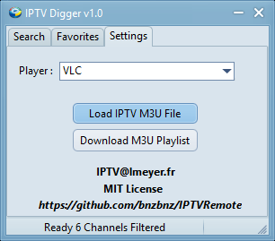
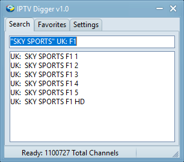
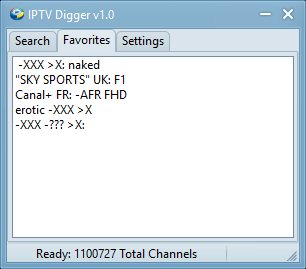

# IPTV-Digger
Filter your IIPTV channels by simple queries , open the player of your choice and more to come (download.. etc....)

# How does it work ?
if you are like me and think that IPTV player are, well, crap, because you can never find anything, then try IPTVDigger.
This app filters the channels information with a simple query



First you have to choose your player, and provide your own M3U url or a file.
A clean playlist is then created and it will be refreshed evey hour.
You will get  a 1100K channels to filter (depenfing of your provider).
I DO NOT PROVIDE ANY M3U, IT IS ILLEGAL, BUY YOUR OWN...
FYI: In France it is a $4000 fine...



Now You have to filter all this channel, let say you like formula one (english)
```Delphi
The query will be : "SKY SPORTS" F1 UK:
```
Your looking to match the string "SKY SPORTS" and the string F1 with the language EN:. You ll match : 'UK:  SKY SPORTS F1 HD' :
1. by default a string if inclusive : EN: F1 etc..
2. Preceding "-" means exclusive : -XXX to exclude.. well, you see what I mean :)
3. ">" start with: -EN: to exclude all english channels
4. "+TV' to get all live stream channels
5. "+MOV" to get only movies/series channels (they will follow by a star '*' meaning downloadable (to come...)



You can then add your query in the favorites :
1. look to "naked" but not in porn
2. As we have seen, looking for english F1
3. Cannal+, a private TV channels in France
4. again porn exclusion test

I will add an option to block XXX in the playlist...

Technical:
--------------


